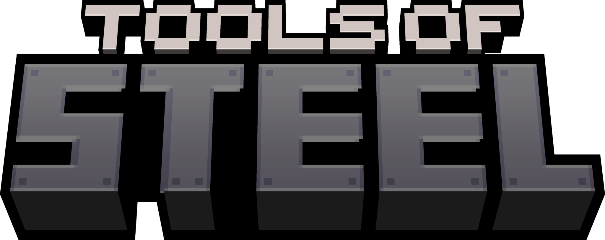

#

 

  

This mod focuses on making equipment progression better by adding a new material, steel!

For more info, check out the [Modrinth page](https://modrinth.com/mod/tools-of-steel)!

#

### Code References

[Bronze Mod](https://github.com/Khazoda/bronze) - MIT License

[AdventureZ](https://github.com/Globox1997/AdventureZ) - GPL-3.0 License

[Kaupenjoe's Fabric 1.20.X Tutorial Repo](https://github.com/Tutorials-By-Kaupenjoe/Fabric-Tutorial-1.20.X) - MIT License

[Kaupenjoe's Fabric 1.21.X Tutorial Repo](https://github.com/Tutorials-By-Kaupenjoe/Fabric-Tutorial-1.21.X) - MIT License

### Video References

[Modding by Kaupenjoe](https://www.youtube.com/@ModdingByKaupenjoe) - YouTube Channel

[Kaupenjoe's 1.21.X Fabric Modding Tutorial Series](https://www.youtube.com/watch?v=oU8-qV-ZtUY&list=PLKGarocXCE1H_HxOYihQMq0mlpqiUJj4L) - YouTube Playlist